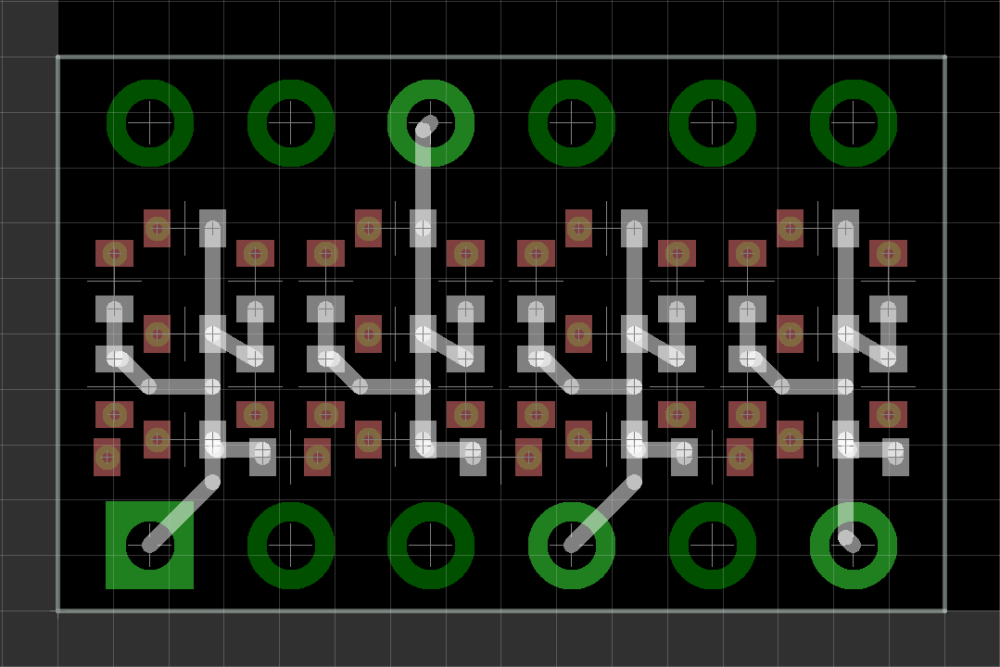
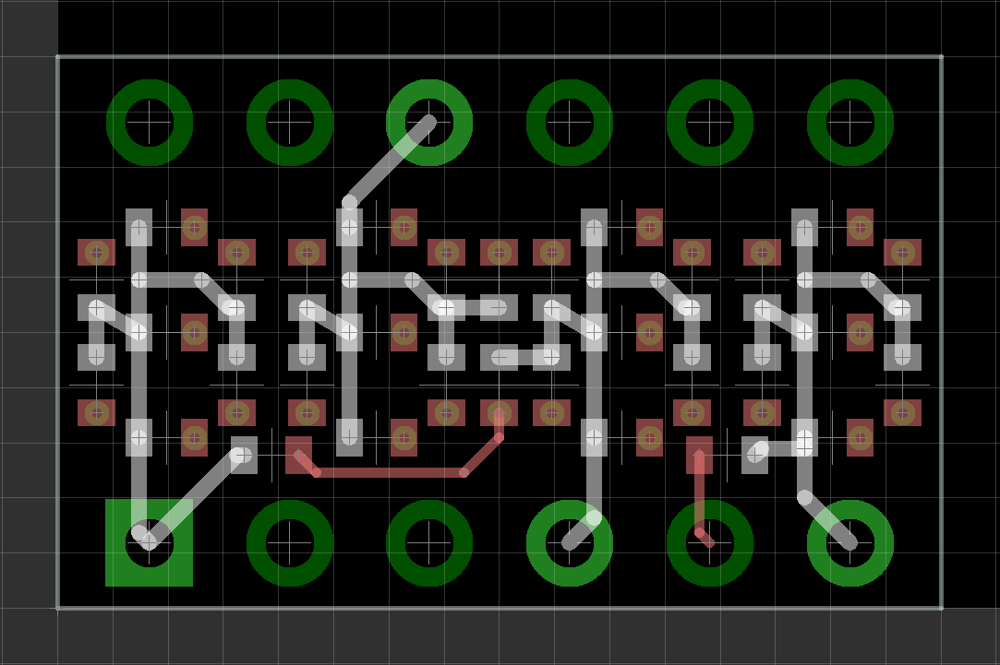

# QDSP
■概要  
4桁7セグメント表示基板です。  
1005(metric)サイズのLEDをはんだづけして作成します。  
  
■詳細  
チップLEDをカーソードコモンの方向で取り付けることにより  
HP QDSP-6064ピンコンパチブルで動作する4桁7セグメント表示基板です。  
  
QDSP-0408Dは1番右のドットがなし8.8.8.8の表示、  
LEDを31個使用します。  
  
QDSP-0408Cは時計用に真ん中にコロン用のLEDあり、  
コロンも1ずつ点灯可能8.8:8.8の表示、LEDを32個使用します。  
  
1x6ピンヘッダを2個使用します。  
  
■注意事項  
頒布品に付属しない部品等ついてはユーザー様にてご用意下さい。  
  
■コモンPADの確認方法  
実装面にコモンとなるセグメントの配線があります。  
実際の基板ではレジストの影響で確認しにくいため以下の画像を参考にして
LEDを実装してください。  

その他の確認方法としてはPADにVIAの穴がないPADがコモンPADです。  
※ハンダの影響でVIAを確認しづらい場合があります。  
  
■QDSP-0408D コモンPAD  

  
■QDSP-0408C コモンPAD  

